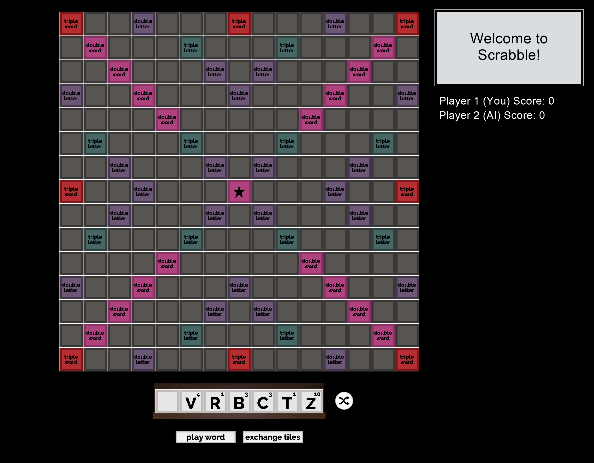

# Final Project: Scrabble with Bot Implementation

Read [this document](https://cliutils.gitlab.io/modern-cmake/chapters/basics/structure.html) to understand the project
layout.

**Author**: Nishant Balepur - [`balepur2@illinois.edu`](mailto:balepur2@illinois.edu)

***

### Getting Started

This project was created in CLion to be used in C++ applications with Microsoft Visual Studio 14.0 and Cinder, as well as the CinderBlock [Box2D](https://github.com/cinder/Cinder/tree/master/blocks/Box2D).

Instructions on how to change your version of Microsoft Visual Studio can be found [here](https://courses.grainger.illinois.edu/cs126/sp2020/assignments/snake/)
**(only the instructions of Part 0)**.

In order to integrate [Box2D](https://github.com/cinder/Cinder/tree/master/blocks/Box2D) into the project, you may need
to fork the library to add it to the project. This library is used to control the tile movement, so its important to
make sure its properly installed before you begin using the application. Instructions on how to fully integrate this
library with CMake can be found [here](https://courses.grainger.illinois.edu/cs126/sp2020/notes/cmake/).

---

### Basic Usage

#### This application can be used mainly in two different ways: to practice Scrabble gameplay or to implement your own AI

**Note: In order to run the application, run the run.cc file using the cinder-myapp configuration**

#### 1) Practicing against the AI

Practicing against the AI is very simple as the application follows the standard rules of scrabble.
Please refer to the image above to understand the different buttons and components I will be discussing
  
#### <u>Placing Tiles</u>
When it is your turn to play, you can place tiles on the board by holding down left click and dragging the desired tile
onto the board from your tile holder. When all of the tiles are on the board to your liking, you can press the "Play Word"
button

The text box in the upper right corner will let you know either how many points you scored, or an error message if there
was a problem with your turn. Some of these error messages include: the word not being connected to the board properly,
a word not in the Scrabble Dictionary being played, or a repeated word being played
  
#### <u>Exchanging Tiles</u>
If you are unsatisfied with the tiles on your holder, you have the option to exchange your tiles, which can be done by
pressing the "Exchange Tiles" button. Please keep in mind that this will exchange all of your tiles and you will lose
your turn, allowing the AI to play again
  
#### <u>Blank Tiles</u>
If you happen to play a blank tile, the text box will prompt you to set the value of the tile. This can be done by typing
the desired letter on the keyboard. This message will not go away and you will be unable to drag any more tiles until the
value is set. In order to change the value of the blank tile after placing it, simply pick it up and place it back down
  
#### <u>Shuffle Tiles</u>
There is also a shuffle tile button to the right of the tile holder. Pressing this button will only rearrange the tiles
in your holder; nothing about them will change except for the position in the holder. This can be useful if you want to
look at the word at a different angle
   
After playing your word, the bot will pause the game for around four seconds so you can read the result of your word
in the text box window. During this time, you will be unable to move your tiles to the board, shuffle your tiles, etc.
Then, the bot will play its word. The initial bot is designed to play longer words to help you practice your own
word-making skills. Thus, the bot will not target the multipliers, allowing you to strategize accordingly

When the game is over, you will have the option to play again. To do so, type "y" when prompted to. To exit the program,
type "n"
  
#### 2) Implementing your own AI

The simplest way to implement your own AI would be to change the logic in the ai.h file. There is a struct called
SortByBaseWordScore, which has an inline bool operator that can be changed to your liking. The program already generates
all possible words that the AI can play, so you may adjust the difficulty by changing this sorting algorithm.

Initially, the bot prioritizes making eight letter words with the highest base score (no letter or word multipliers). To
alter this, simply change the comparator

---

### Known Bugs

**There are a few known bugs in the program that will hopefully be fixed in the future**

#### 1) Tile placement errors

When adjusting the tiles in the tile holder, there is a chance that the tiles will get jumbled. The best way to avoid this
is to press the shuffle button, which will reset all of the tile's indexes. This has something to do with the transform
function for bodies in Box2D

#### 2) Bot playing invalid words

Sometimes, the bot may play an invalid word. When this happens, the bot will not get points for this turn, which will
give you an extra turn
   
**If you find any more bugs, please email me at <u>balepur2@illinois.edu</u> with your issue. Thank you!**

